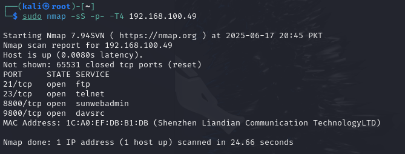
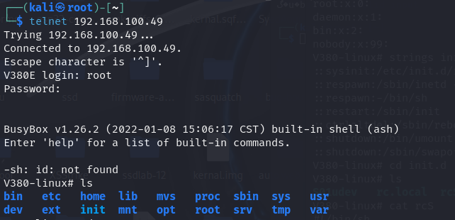

# Research-on-v380-cctv-ip-camera

## Summary of Vulnerability
Telnet service is exposed by default on a IP camera. A user can remotely acesss the telnet service using hard-coded credntials that will allow user shell access as root.

## Firmware Info
- App: AppFHE1_V1.0.6.020230803
- Kernel: KerFHE1_PTZ_WIFI_V3.1.1
- Hardware: HwFHE1_WF6_PTZ_WIFI_20201218

## Nmap Output
here is the nmap scan results

## Telnet Session
here is screenshot of sucessful login as root on telnet 

## Notes
- Vendor not reachable
- MAC OUI: 1C:A0:EF (Shenzhen Liandian Communication Technology LTD)
- Telnet access gives root-level shell
