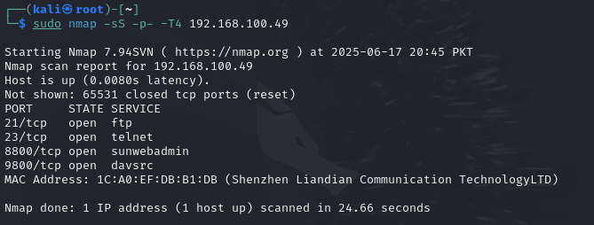
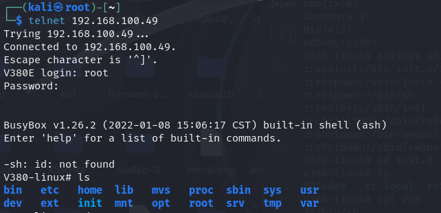
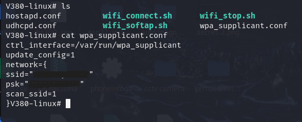

# Research on V380 CCTV IP Camera

## CVE-2025-7503

 ### Summary of Vulnerability

A commercial IP camera exposes a **Telnet service (port 23)** by default. This service is **undocumented** and accessible using **hard-coded credentials**, which grant root shell access.

This access poses serious security risks, as:
- Users are unaware of the Telnet interface.
- There is no prompt to change these credentials.
- Telnet cannot be disabled through the mobile app.

---

### Firmware & Software Info

- **App Version**: `AppFHE1_V1.0.6.020230803`
- **Kernel Version**: `KerFHE1_PTZ_WIFI_V3.1.1`
- **Hardware Version**: `HwFHE1_WF6_PTZ_WIFI_20201218`
- **MAC OUI**: `1C:A0:EF` (Shenzhen Liandian Communication Technology LTD)

---

### Nmap Output

Scan showing the Telnet service (port 23) is open:



---

### Telnet Session

An attacker can obtain root shell access to the device's filesystem by authenticating via Telnet using the following default and undocumented credentials:

   * Username: `root`
   * Password: `gzhongshi`

Below is a screenshot demonstrating a successful Telnet login with root privileges:



---

### Notes

- Vendor does not provide a way to disable Telnet.
- No vendor contact or security advisory page found.
- Root shell access allows complete control over the device, including filesystem, networking, and camera feeds.

---

### Security Impact

- **Privilege Escalation**: Immediate root access
- **Remote Code Execution**: Commands can be executed on the system
- **Backdoor Risk**: Service is undocumented, invisible to the user
- **No Fix Available**: No firmware updates or mitigations provided by vendor

---

###  Discoverer

Discovered by: **Aoun Shah**

Collobration : **Muhammad Zubair**

---

### 🔗 References
- [CVE-2025-7503](https://www.cve.org/cverecord?id=CVE-2025-7503)

---

## Plaintext wifi credentials in the filesystem

### Summary of Vulnerability
Shenzhen Liandian Communication Technology LTD OEM IP camera (hardware id: HwFHE1_WF6_PTZ_WIFI_20201218) with firmware AppFHE1_V1.0.6.0 was discovered to store plaintext Wi-Fi credentials in the filesystem. This vulnerability allows attackers with root shell access to retrieve Wi-Fi SSIDs and passwords directly from the device’s storage.

### Details
Wi-Fi credentials are stored in `/tmp/wificonf/wpa_supplicant.conf` file on the filesystem.The contents of this file can be accessed throught linux commands in the root shell of the device.

Here is the screenshot of the file




### Proof of Concept:
  Gain root shell access (e.g. through [CVE-2025-7503](https://www.cve.org/cverecord?id=CVE-2025-7503))
  Run `cat /tmp/wificonf/wpa_supplicant.conf` command
  Verify credentials being displayed

### Impact:
An attacker with root shell access can gain access to plaintext credentials. This allows the attacker to gain access to the Wi-Fi network.


## Reverse Engineering

This Section contains the reverse engineering of the main binary of the camera found during the firmware analyis. The main binary for camera is called `recorder`.

### Broken Access Control Leading to Critical Live Video Exposure

While reverse engineering the camera’s main binary, I found an interesting piece of code related to RTSP streaming.


This code was executed every time the camera booted. The function acts as the firmware’s **RTSP streaming worker thread**. Its job is to check whether RTSP is enabled in the INI configuration, initialize the RTSP/ONVIF services, pull audio and video frames from internal queues, package them, and push them to the RTSP server.

The RTSP enable flag is read using:

```c
IniFileReadInt("/mnt/mtd/mvconf/factory_const.ini", "[CONST_PARAM]", "rtsp_enable", 0);
```

The firmware checks whether the following value exists in `factory_const.ini`:

```ini
[CONST_PARAM]
rtsp_enable=1
```

If RTSP is not enabled, the function retries for about **21 seconds** and then exits. This made the INI value a strong control point for enabling RTSP.

I had seen similar behavior in another camera where enabling RTSP exposed the live video stream without enforcing the normal authentication and authorization checks. Because of that, this looked like a good place to test whether the same issue existed here.

Using the limited commands available on the device, I modified the configuration file and changed the RTSP value to `1`.


After rebooting the camera, the RTSP service started successfully.

The next step was to check whether the camera would allow live streaming without requiring authentication. After testing the RTSP endpoint, I was able to access the live camera feed without providing any credentials.

Normally, the camera requires authentication and authorization before allowing access to the video stream. However, enabling RTSP through this configuration bypassed those checks and exposed the live feed directly.

---
> This report is part of responsible disclosure efforts. This information is provided for educational and defensive security purposes only.
